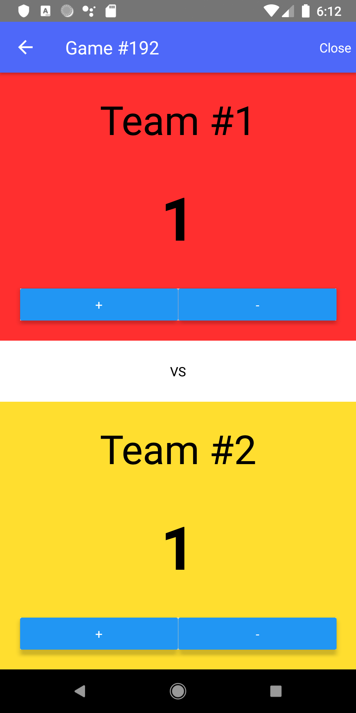
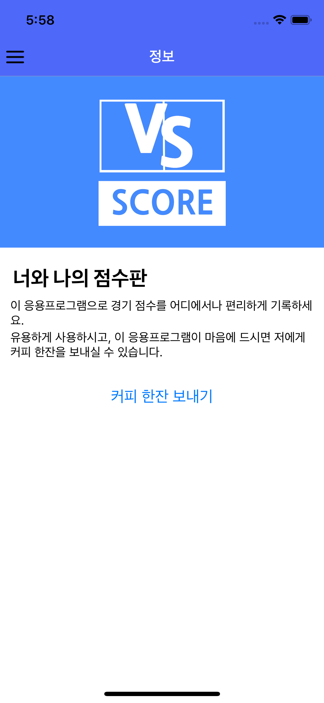
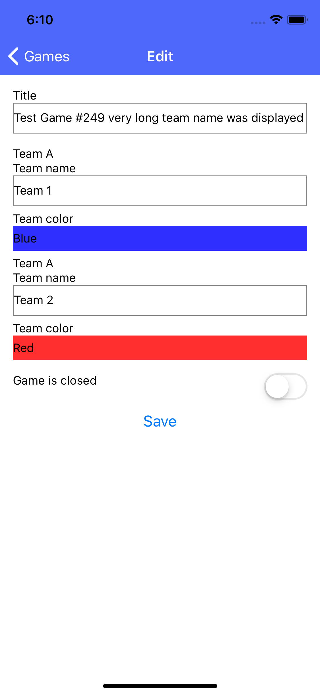
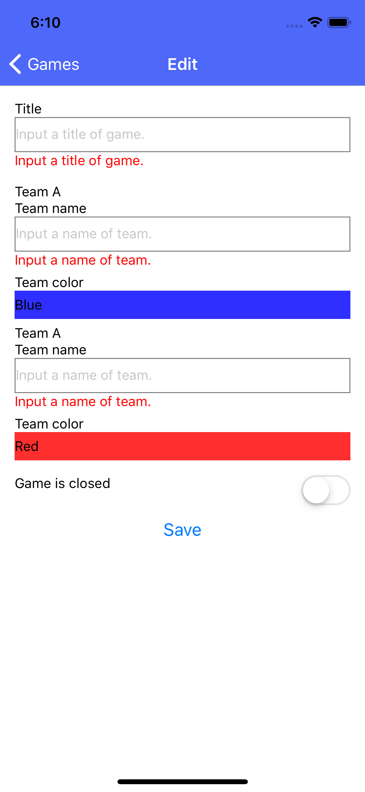

Xamarin 으로 작성된 모바일 응용프로그램을 React Native로 변환합니다.

# 모바일 응용프로그램

## Google Play

[너와 나의 점수판](https://play.google.com/store/apps/details?id=kr.bbon.ScoreBoard)

## React Native 로 작성된 응용프로그램

### Android 

#### 장치의 언어가 한국어인 경우

#### 장치의 언어가 한국어가 아닌 경우

### iOS

#### 장치의 언어가 한국어인 경우

#### 장치의 언어가 한국어가 아닌 경우

